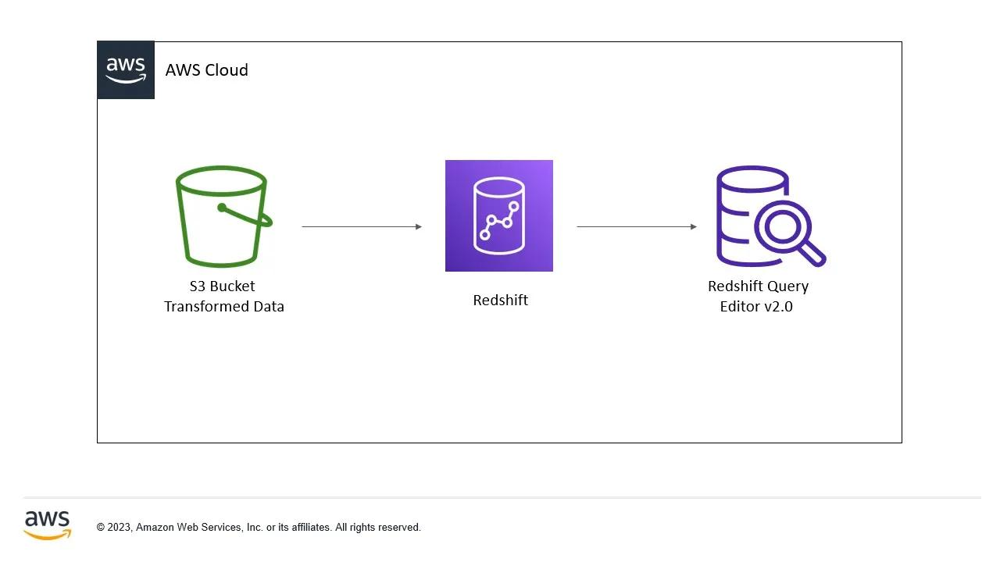

# AWS Redshift Data Warehouse Lab

This project demonstrates how to build a simple Data Warehouse on AWS using Amazon Redshift and Amazon S3.

## Architecture



---

## Project Overview

In this lab, a CSV dataset is uploaded to an Amazon S3 bucket and then imported into an Amazon Redshift cluster using the COPY command. SQL queries are executed through Redshift Query Editor V2 to analyze the data.

---

## AWS Services Used

- Amazon Redshift
- Amazon S3
- AWS IAM
- Query Editor V2

---

## Project Structure

```
AWS-Redshift-DataWarehouse-Lab/
│
├── architecture.jpg
├── README.md
│
├── data/
│   └── consumers-price-index-march-2026-quarter-index-numbers.csv
│
└── screenshots/
    ├── 01-create-iam-role.png
    ├── 02-create-s3-bucket.png
    ├── 03-upload-csv.png
    ├── 04-create-redshift-cluster.png
    ├── 05-query-editor.png
    ├── 06-create-table.png
    ├── 07-copy-command.png
    ├── 08-select-data.png
```

---

## Lab Objectives

- Create an IAM Role for Redshift
- Create a private Amazon S3 bucket
- Upload a CSV dataset
- Create an Amazon Redshift Cluster
- Connect using Query Editor V2
- Create database tables
- Load data from S3 using the COPY command
- Execute SQL queries to analyze the data

---

## Step 1 - Create IAM Role

Create an IAM Role with the following permission:

- AmazonS3ReadOnlyAccess

Attach the role to the Redshift cluster.

---

## Step 2 - Create an Amazon S3 Bucket

Create a private S3 bucket and upload the dataset.

Example:

```
consumers-price-index-march-2026-quarter-index-numbers.csv
```

---

## Step 3 - Create Redshift Cluster

Example configuration

- Cluster Type: Single Node
- Database: analytics
- Username: admin
- Password: ********

---

## Step 4 - Create Table

Example

```sql
CREATE TABLE sales (
    id INT,
    customer_name VARCHAR(100),
    product VARCHAR(100),
    quantity INT,
    price DECIMAL(10,2),
    sale_date DATE
);
```

---

## Step 5 - Load Data

```sql
COPY sales
FROM 's3://your-bucket/sales_data.csv'
IAM_ROLE 'arn:aws:iam::ACCOUNT_ID:role/RedshiftRole'
CSV
IGNOREHEADER 1;
```

---

## Step 6 - Query Data

Example queries

```sql
SELECT * FROM sales;
```

```sql
SELECT COUNT(*) FROM sales;
```

```sql
SELECT SUM(price) FROM sales;
```

```sql
SELECT product, COUNT(*)
FROM sales
GROUP BY product;
```

---

## Screenshots

The **screenshots** folder contains all important steps of the lab.

- IAM Role
- S3 Bucket
- Upload Dataset
- Redshift Cluster
- Query Editor
- Table Creation
- COPY Command
- Query Results

---

## Skills Demonstrated

- Amazon Redshift
- Amazon S3
- IAM Roles
- SQL
- Data Warehouse
- ETL
- COPY Command
- Query Editor V2

---

## Learning Outcomes

After completing this project, you will understand how to:

- Build a simple data warehouse
- Store datasets in Amazon S3
- Load data into Amazon Redshift
- Execute SQL queries
- Analyze structured data in AWS

---

## Author

**Boubacar Djibrilla**

Cloud & DevOps Engineer (Learning Journey)

GitHub

https://github.com/boubacardjibrilla